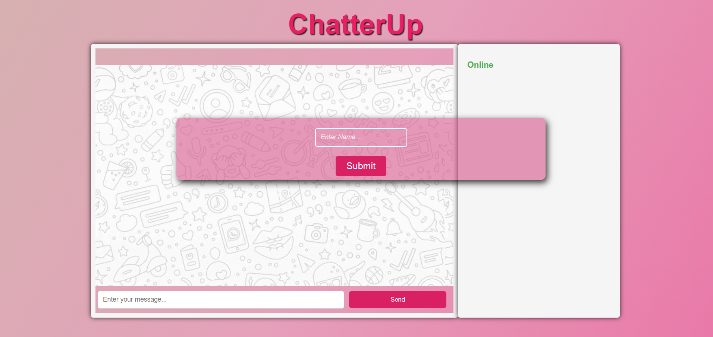
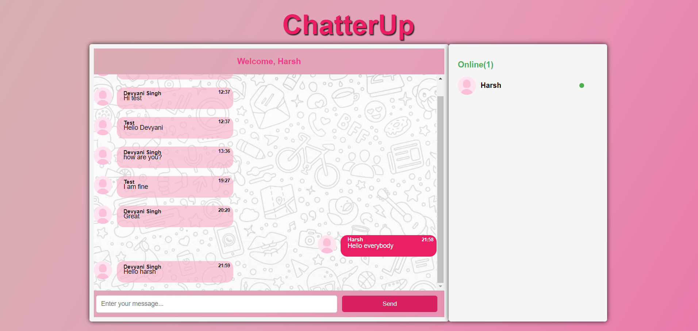

### CHATERUP APP - Real-Time Chat Application

ChatterUp is an interactive real-time chat application designed to facilitate seamless communication and interaction between users. The application is built by using Node.js, Express.js, Socket.io, and MongoDB, it offers a robust and engaging chat experience.

## Features

- **User Authentication:** Users can join the chat with a username.

- **Real-time Messaging:** Users can send and receive messages instantly.

- **Online Users Display:** Shows a list of all online users.

- **Chat History:** Displays previous messages from the database.

- **Typing Indicator:** Displays a "typing..." status when a user is typing.

## Tech Stack

- **Frontend:**

  - HTML, CSS, JavaScript
  - Socket.IO (Client-Side)

- **Backend:**

  - Node.js with Express
  - Socket.IO (Server-Side)
  - MongoDB with Mongoose

- **Database:** MongoDB

## How It Works

1. User Authentication

   - When the user opens the app, they are prompted to enter their name.
   - The name is sent to the server and added to the list of online users.

2. Real-time Communication

   - Users can send messages via the message input field.
   - Messages are emitted to the server and broadcast to all connected clients.

3. Chat History

   - On connecting, the server fetches old messages from the MongoDB database and sends them to the client.

4. Online Users

   - The server tracks online users and broadcasts the list to all clients whenever there is a change.

## Screenshots

### Home Page

### Chat Screen

